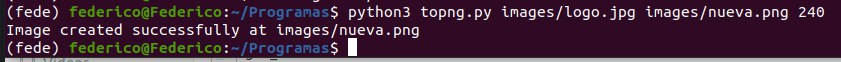

## toPNG

toPNG is a python script that turns the white elements of a image into a PNG with a transparency layer.

### Running it:

The script takes in three arguments.
* Path to the input file
* Path to the output file
* Sensibility(optional): A value from 0 to 255 to determine how whitish an element has to be in order to be turned transparent. 255 would imply only pure whites are turned transparent.
* It also has a -h help command, which will explain  the arguments needed to run the script.

### Examples:

Input image:

240 sensibility:

250 sensibility:

255 sensibility:

